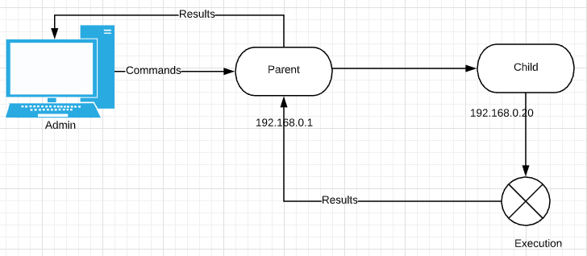

# Emulate.GO
A tool to abstract away the complexity of executing command line indicators in adversary emulation.

# How to Use - Basics
Use the executable for Windows

Use the ELF binary for Linux

Run with Go: `go run emulation.go`

## Admin Mode
`go run emulation.go -mode admin -listen 127.0.0.1:9999`

The Admin mode is used to emulate the C2 infrastructure (attacker on an external network). The following functions are available:  
* Execute command line actions manually
* Send a list of commands to be executed

## Client Mode
`go run .\emulation.go -mode client -clientconnect 127.0.0.1:9999`

The client mode will receive commands or list of commands from the Admin (Or parent) interface, then execute on the operating system and send the results back.

## Parent Proxy Mode
`go run .\emulation.go -mode parent -parentconnect 127.0.0.1:9999 parentlisten 127.0.0.1:10000`

The Parent Proxy mode is to act as a way to forward commands to a third machine. The parent will act as a proxy for commands and command execution results between the Admin interface and client interface.

# Admin specific Options:
## -logging
`-logging <filename>`
This will add JSON logging to a file from within the Admin interface.

This is to allow documentation of commands executed with timestamps.

Example of JSON output:  

# Generic Options

## -tls
This will add encryption to all modes. The network traffic sent and received will be encrypted with a self signed certificate supplied within the tool itself.

## -skip
This will skip the ENTER requirements when launching each mode. This was added to prevent script kiddies from running the tool.

Example of program pause:

## -silence
Only available in parent and client modes.
`-silence`

This will cause the parent and client modes to not print anything to the screen.

# Visual Representation of Modes

## Standard Admin and Client

## Using Parent Proxy Mode

